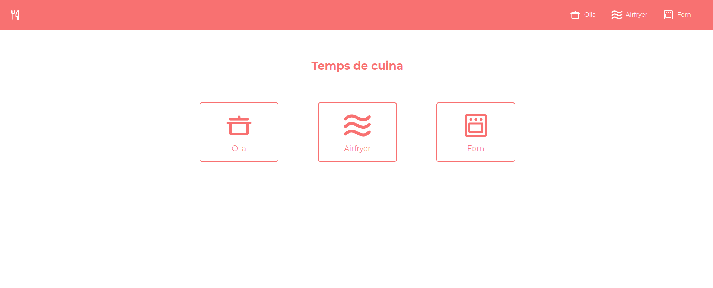

<a name="readme-top"></a>

[![LinkedIn][linkedin-shield]][linkedin-url]

<!-- PROJECT LOGO -->
<br />
<div align="center">
  <a href="https://temps-cuina.vercel.app">
    
  </a>

  <h3 align="center">Temps de cuina</h3>

  <p align="center">
    The cooking guide for optimal times and temperatures provides precise recommendations for baking, air frying, and boiling various ingredients, ensuring perfect results every time.
    <br />
    <br />
    <a href="https://temps-cuina.vercel.app">Visit website</a>
    ·
    <a href="https://github.com/alex-olle/temps-cuina/issues">Report Bug</a>
    ·
    <a href="https://github.com/alex-olle/temps-cuina/issues">Request Feature</a>
  </p>
</div>

<!-- TABLE OF CONTENTS -->
<details>
  <summary>Table of Contents</summary>
  <ol>
    <li>
      <a href="#about-the-project">About The Project</a>
      <ul>
        <li><a href="#built-with">Built With</a></li>
      </ul>
    </li>
    <li>
      <a href="#getting-started">Getting Started</a>
      <ul>
        <li><a href="#installation">Installation</a></li>
      </ul>
    </li>
    <li><a href="#roadmap">Roadmap</a></li>
    <li><a href="#contact">Contact</a></li>
    <li><a href="#acknowledgments">Acknowledgments</a></li>
  </ol>
</details>

<!-- ABOUT THE PROJECT -->

## About The Project



**Temps de cuina** is a user-friendly platform that provides precise cooking recommendations for a variety of ingredients across different cooking methods, including oven baking, air frying, and boiling. Designed to simplify meal preparation, this guide helps users achieve perfectly cooked dishes with ease by offering reliable temperature and time settings for each ingredient.

Objectives:

- Ensure optimal cooking results by providing accurate temperature and time recommendations for different ingredients.
- Simplify meal preparation and reduce guesswork for home cooks of all skill levels.

Benefits:

- For Home Cooks: Eliminates uncertainty in cooking, leading to consistent and delicious results.
- For Beginners: Provides a reliable reference to build confidence in the kitchen.

<p align="right">(<a href="#readme-top">back to top</a>)</p>

### Built With

[![Astro][Astro]][Astro-url]

<p align="right">(<a href="#readme-top">back to top</a>)</p>

<!-- GETTING STARTED -->

## Getting Started

### Installation

1. Clone the repo
   ```sh
   git clone https://github.com/alex-olle/temps-cuina.git
   ```
2. Install NPM packages
   ```sh
   npm install
   ```
3. Run the project
   ```sh
   npm run dev
   ```

<p align="right">(<a href="#readme-top">back to top</a>)</p>

<!-- ROADMAP -->

## Roadmap

- [] Add more times

See the [open issues](https://github.com/alex-olle/temps-cuina/issues) for a full list of proposed features (and known issues).

<p align="right">(<a href="#readme-top">back to top</a>)</p>

<!-- CONTACT -->

## Contact

Àlex Ollé - [Linkedin](https://www.linkedin.com/in/alejandro-olle-ramos/)

Project Link: [Github](https://github.com/alex-olle/temps-cuina)

<p align="right">(<a href="#readme-top">back to top</a>)</p>

<!-- ACKNOWLEDGMENTS -->

## Acknowledgments

- [Img Shields](https://shields.io)

<p align="right">(<a href="#readme-top">back to top</a>)</p>

<!-- MARKDOWN LINKS & IMAGES -->
<!-- https://www.markdownguide.org/basic-syntax/#reference-style-links -->

[linkedin-shield]: https://img.shields.io/badge/-LinkedIn-black.svg?style=for-the-badge&logo=linkedin&colorB=555
[linkedin-url]: http://www.linkedin.com/in/alejandro-olle-ramos
[Astro]: https://img.shields.io/badge/astro-%232C2052.svg?style=for-the-badge&logo=astro&logoColor=white
[Astro-url]: https://astro.build/
